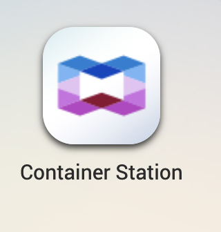

# MS SQL in a container
This repository is documenting various aspects of using MSSQL as a docker container and / or installing it on an OpenShift Cluster

The main source of information from mssql on unix / docker can be found at

 https://docs.microsoft.com/en-us/sql/linux/sql-server-linux-overview?view=sql-server-ver15

A very good source for further information can be found here: 

https://github.com/johwes/sqlworkshops-sqlonopenshift

## Overview:

### Installation of sqlserver using containerstation of [QNAP NAS](Qnap/qnap.md) 
 

--

### Installation on IBM Cloud on an OCP Cluster classic [OCP@IBMCloud](IBMcloud/ibmcloud.md)  
 

....

